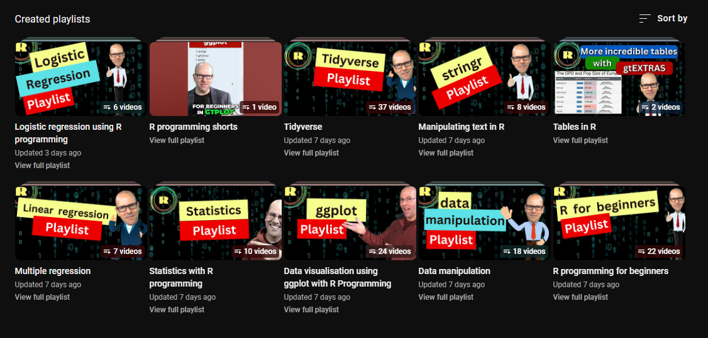
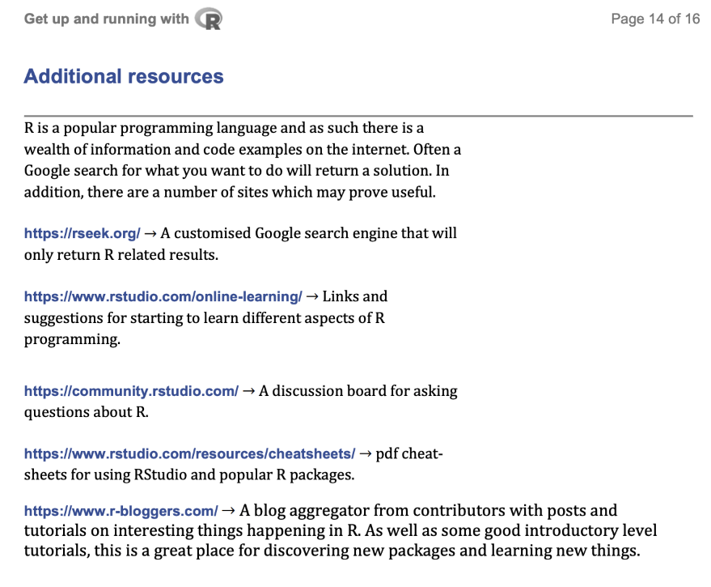

# General Resources

## Overview

- YouTube channel: [R Programming 101](https://www.youtube.com/c/rprogramming101)
  - 
- [R Cheatsheets pdf](<R Cheatsheets.pdf>) (p. 3-4)
- [R Markdown website](https://bookdown.org/yihui/rmarkdown/how-to-read-this-book.html)
- Additional resources:
  - 
- [Verzani, J. (2018). Using R for introductory statistics](https://cran.r-project.org/doc/contrib/Verzani-SimpleR.pdf)
  - Chapter 1 for introductions
  - Other chapters for data analysis
- [Data Mining with Rattle and R ](https://link.springer.com/book/10.1007/978-1-4419-9890-3)

- **Swirl** (R module; self-paced workshop)
  - Swirl setup: ["You're a student!"](https://swirlstats.com/students.html)
  - `swirl::info()`
    ```C
    | When you are at the R prompt (>):
    | -- Typing skip() allows you to skip the current question.
    | -- Typing play() lets you experiment with R on your own; swirl will ignore what you do...
    | -- UNTIL you type nxt() which will regain swirl's attention.
    | -- Typing bye() causes swirl to exit. Your progress will be saved.
    | -- Typing main() returns you to swirl's main menu.
    | -- Typing info() displays these options again.
    ```
